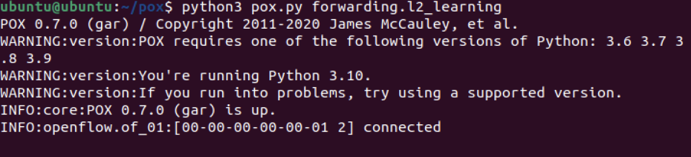
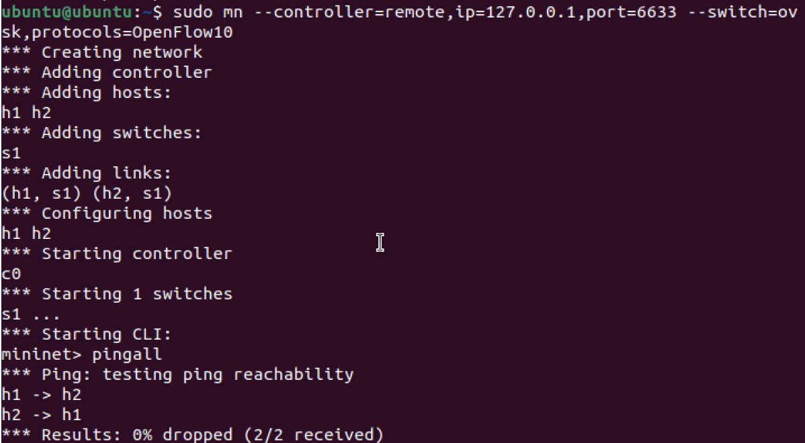
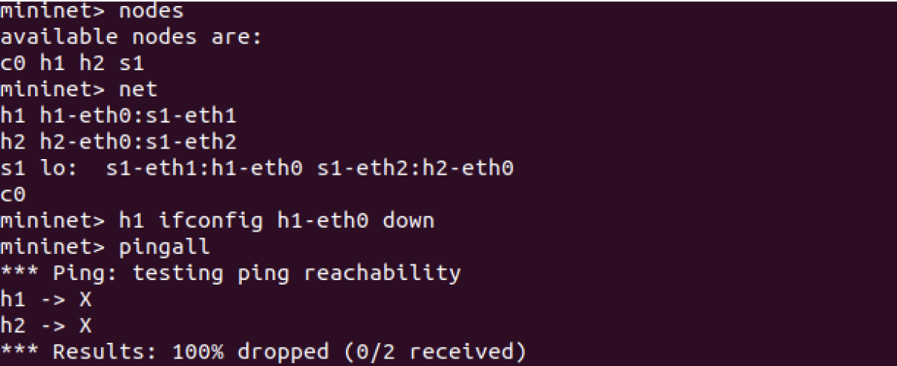
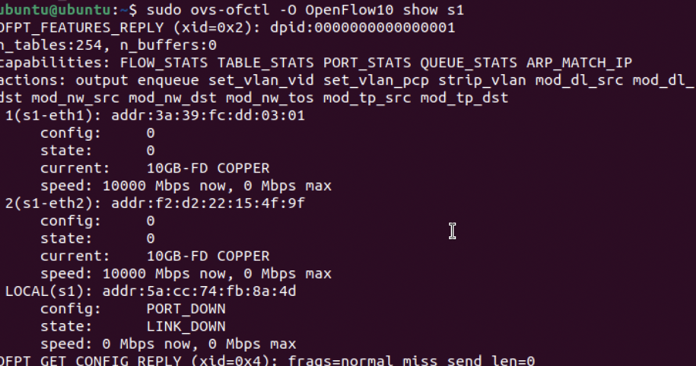

# SDN Learning Switch using Mininet and POX

---

## 1. Problem Statement

This project implements a **Software Defined Networking (SDN) Learning Switch** using Mininet and a POX controller.

The objective is to:
- Separate control plane and data plane
- Use a controller to dynamically manage packet forwarding
- Demonstrate OpenFlow-based match–action flow rules
- Handle `packet_in` events using controller logic
- Validate behavior under normal and failure scenarios

---

## 2. Tools & Technologies Used

- Mininet (Network Emulator)
- POX Controller
- Open vSwitch (OVS)
- OpenFlow Protocol
- iperf (for bandwidth testing)

---

## 3. Network Topology

```
h1 ---- s1 ---- h2
```

- h1, h2 → Hosts  
- s1 → OpenFlow Switch  
- c0 → Controller  

---

## 4. Controller Logic (Learning Switch)

The POX controller implements a **learning switch algorithm**:

1. When a packet arrives, the switch sends it to the controller (`packet_in`)
2. Controller learns source MAC → port mapping
3. If destination is known:
   - Install flow rule in switch
   - Forward packet directly
4. If destination unknown:
   - Flood packet
5. Future packets follow installed flow rules

---

## 5. Setup & Execution Steps

### Step 1: Clone POX
```
git clone https://github.com/noxrepo/pox.git
cd pox
```

### Step 2: Start Controller
```
python3 pox.py forwarding.l2_learning
```

### Step 3: Start Mininet
```
sudo mn --controller=remote,ip=127.0.0.1,port=6633 --switch=ovsk,protocols=OpenFlow10
```

### Step 4: Verify Topology
```
nodes
net
```

---

## 6. Test Scenarios

### Scenario 1: Normal Communication
```
pingall
```

Expected:
- Successful communication
- 0% packet loss

📸 Screenshot:


---

### Scenario 2: Failure Simulation
```
h1 ifconfig h1-eth0 down
pingall
```

Expected:
- Communication failure
- 100% packet loss

📸 Screenshot:


---

### Scenario 3: Bandwidth Test (iperf)
```
iperf h1 h2
```

Expected:
- TCP bandwidth output

📸 Screenshot:


---

### Scenario 4: Flow Table Inspection
```
sudo ovs-ofctl -O OpenFlow10 show s1
```

Expected:
- Flow rules showing MAC-based forwarding

📸 Screenshot:


---

### Scenario 5: Switch Information
```
sudo ovs-ofctl -O OpenFlow10 show s1
```

Expected:
- Port and switch details

📸 Screenshot:


---

## 7. Results

- Learning switch successfully implemented
- Flow rules dynamically installed
- Packet forwarding works without controller after learning
- Network responds correctly to failures
- Bandwidth successfully measured using iperf

---

## 8. Validation

| Test Case | Result |
|----------|-------|
| Ping (Normal) | PASS |
| Ping (Failure) | PASS |
| iperf Test | PASS |
| Flow Table Verification | PASS |

---

## 9. Key Concepts Demonstrated

- OpenFlow Match–Action Model
- Packet_in Handling
- Dynamic Flow Rule Installation
- Controller-based Network Management
- Software Defined Networking Principles

---

## 10. References

- https://mininet.org/
- https://github.com/noxrepo/pox
- https://opennetworking.org/
- OpenFlow Switch Specification

---

## 11. Author

Name: Riyana Karthik
Course: Computer Networks / SDN Lab  
Project: SDN Learning Switch
